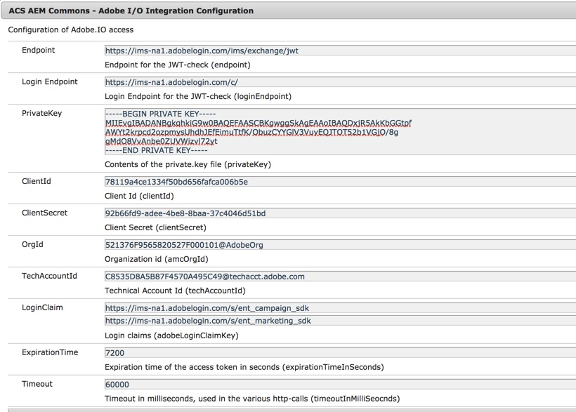
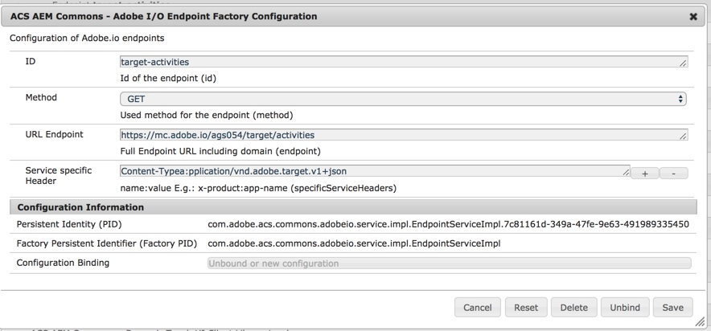
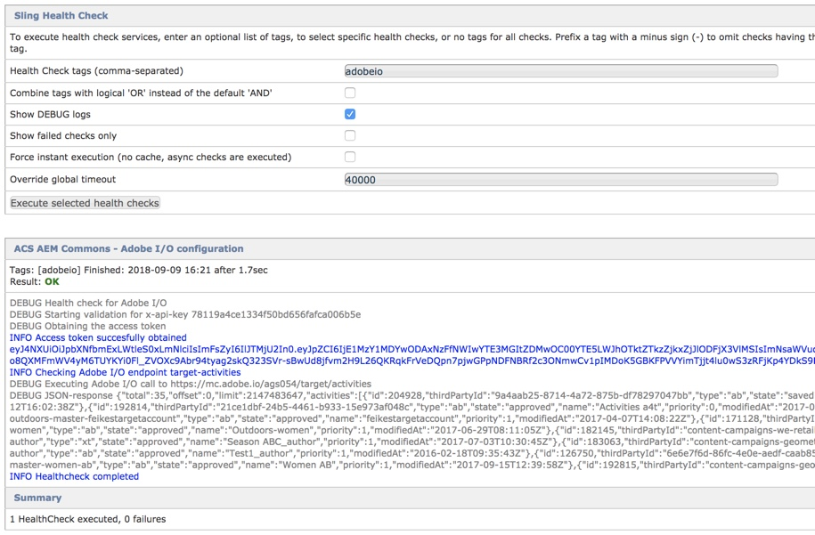

This feature enables you to make Adobe I/O api-calls, whereby all the plumbing is done for you.

Follow this article to setup your integration on Adobe I/O: https://blogs.adobe.com/experiencedelivers/uncategorized/calling-api-adobe-o/

Once this is done you need to configure "ACS AEM Commons - Adobe I/O Integration Configuration" via /system/console/configMgr
The values need to be copied for the integration on https://console.adobe.io.
The private key needs to be copied include the header and footer lines (BEGIN PRIVATE KEY / END PRIVATE KEY)
Login claims can be found under the JWT-tab, values are like https://ims-na1.adobelogin.com/s/ent_campaign_sdk

Once this is done, you can configure the endpoints you want to use, an example is displayed here.

After all these configurations you can use the healthcheck (/system/console/healthcheck) 'adobeio' to test this all.

## How to use this in your code?

When you have defined your endpoints you can use them inside your code like this

    @Reference(target = "(id=getCampaignData)")   
    private EndpointService endpointService;

 Once you have the reference to the EndpointService you can execute the Adobe I/O api calls.
